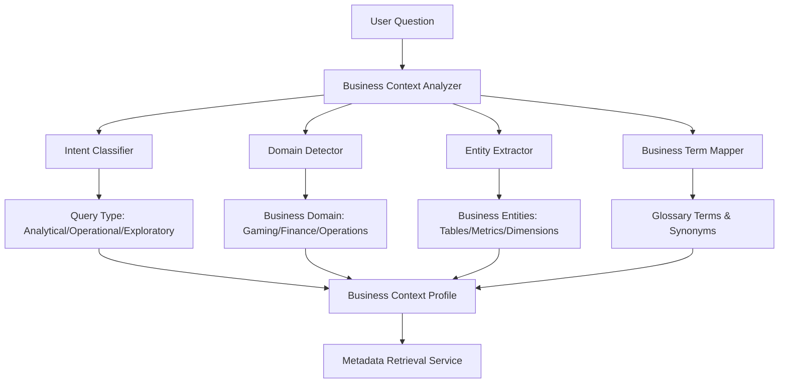
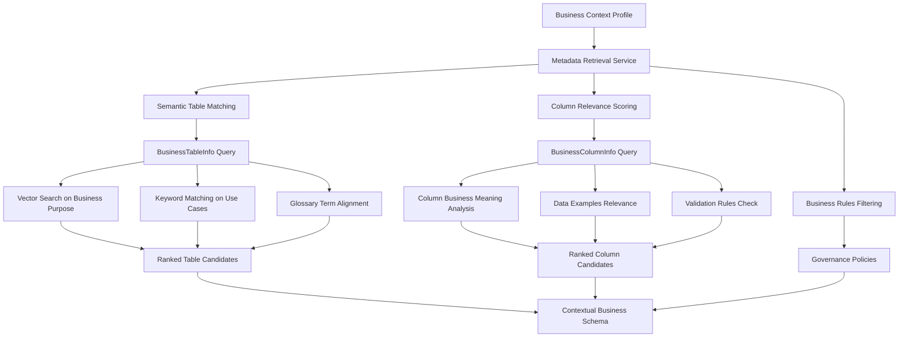
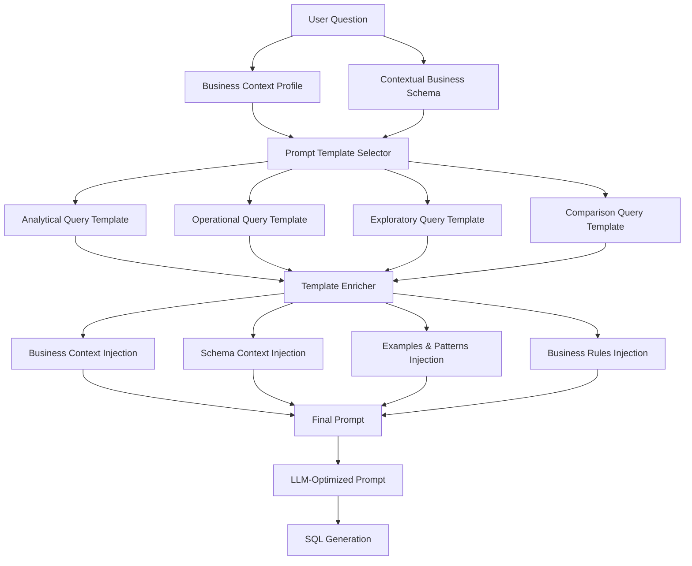

# Business-Context-Aware Prompt Building Module Strategy

## 🎯 Overview

This document outlines a comprehensive strategy for building a sophisticated prompt generation module that leverages business metadata from BusinessTableInfo and BusinessColumnInfo tables to create contextually-aware prompts for natural language to SQL conversion.

## 🏗️ Current Architecture Analysis

### Existing Components
- **PromptService**: Template-based prompt building with schema integration
- **EnhancedSemanticLayerService**: Business metadata integration and contextual schema generation  
- **NLUService**: Natural language understanding with intent classification
- **BusinessTableManagementService**: Rich business metadata management
- **QueryAnalysisService**: Query classification and semantic analysis

### Key Integration Points
- BusinessTableInfo & BusinessColumnInfo entities with rich semantic metadata
- Vector search capabilities for semantic matching
- Existing prompt template system
- Business glossary integration

## 🎯 Strategic Architecture Design

### 1. Business Context Analyzer Service



**Core Responsibilities:**
- Analyze user questions to extract business intent
- Classify query types (analytical, operational, exploratory)
- Detect business domains (gaming, finance, operations)
- Extract business entities and map to glossary terms

### 2. Business Metadata Retrieval Service



**Core Responsibilities:**
- Intelligent retrieval of relevant BusinessTableInfo records
- Semantic matching using business purpose and context
- Column relevance scoring based on business meaning
- Integration of governance policies and data quality indicators

### 3. Contextual Prompt Builder



**Core Responsibilities:**
- Select optimal prompt templates based on query type
- Enrich templates with business context and schema information
- Inject relevant examples and business rules
- Generate LLM-optimized prompts for SQL generation

## 🔧 Implementation Strategy

### Phase 1: Core Services Implementation

#### 1. Business Context Analyzer Service

```csharp
public interface IBusinessContextAnalyzer
{
    Task<BusinessContextProfile> AnalyzeUserQuestionAsync(string userQuestion, string? userId = null);
    Task<QueryIntent> ClassifyBusinessIntentAsync(string userQuestion);
    Task<BusinessDomain> DetectBusinessDomainAsync(string userQuestion);
    Task<List<BusinessEntity>> ExtractBusinessEntitiesAsync(string userQuestion);
}

public class BusinessContextProfile
{
    public string OriginalQuestion { get; set; } = string.Empty;
    public QueryIntent Intent { get; set; }
    public BusinessDomain Domain { get; set; }
    public List<BusinessEntity> Entities { get; set; } = new();
    public List<string> BusinessTerms { get; set; } = new();
    public double ConfidenceScore { get; set; }
    public Dictionary<string, object> Metadata { get; set; } = new();
}
```

#### 2. Business Metadata Retrieval Service

```csharp
public interface IBusinessMetadataRetrievalService
{
    Task<ContextualBusinessSchema> GetRelevantBusinessMetadataAsync(BusinessContextProfile profile);
    Task<List<BusinessTableInfoDto>> FindRelevantTablesAsync(BusinessContextProfile profile, int maxTables = 5);
    Task<List<BusinessColumnInfo>> FindRelevantColumnsAsync(List<long> tableIds, BusinessContextProfile profile);
}

public class ContextualBusinessSchema
{
    public List<BusinessTableInfoDto> RelevantTables { get; set; } = new();
    public Dictionary<long, List<BusinessColumnInfo>> TableColumns { get; set; } = new();
    public List<BusinessGlossaryDto> RelevantGlossaryTerms { get; set; } = new();
    public List<string> BusinessRules { get; set; } = new();
    public double RelevanceScore { get; set; }
}
```

#### 3. Contextual Prompt Builder Service

```csharp
public interface IContextualPromptBuilder
{
    Task<string> BuildBusinessAwarePromptAsync(string userQuestion, BusinessContextProfile profile, ContextualBusinessSchema schema);
    Task<PromptTemplate> SelectOptimalTemplateAsync(BusinessContextProfile profile);
    Task<string> EnrichPromptWithBusinessContextAsync(string basePrompt, ContextualBusinessSchema schema);
}
```

### Phase 2: Advanced Features

#### Business Rules Integration
- Governance policy enforcement
- Data quality indicators
- Access control considerations
- Compliance requirements

#### Adaptive Learning System
- Query pattern recognition
- Success rate tracking
- Prompt optimization based on feedback
- User preference learning

### Phase 3: API Design

#### Core Endpoint

```csharp
[HttpPost("api/prompts/business-aware")]
public async Task<ActionResult<BusinessAwarePromptResponse>> GenerateBusinessAwarePrompt(
    [FromBody] BusinessPromptRequest request)
```

#### Request/Response Models

```csharp
public class BusinessPromptRequest
{
    public string UserQuestion { get; set; } = string.Empty;
    public string? UserId { get; set; }
    public BusinessDomain? PreferredDomain { get; set; }
    public PromptComplexityLevel ComplexityLevel { get; set; } = PromptComplexityLevel.Standard;
    public bool IncludeExamples { get; set; } = true;
    public bool IncludeBusinessRules { get; set; } = true;
}

public class BusinessAwarePromptResponse
{
    public string GeneratedPrompt { get; set; } = string.Empty;
    public BusinessContextProfile ContextProfile { get; set; } = new();
    public ContextualBusinessSchema UsedSchema { get; set; } = new();
    public double ConfidenceScore { get; set; }
    public List<string> Warnings { get; set; } = new();
    public Dictionary<string, object> Metadata { get; set; } = new();
}
```

## 🎯 Key Benefits

1. **Business-Context Awareness**: Leverages rich BusinessTableInfo metadata
2. **Intelligent Relevance**: Uses semantic matching for most relevant business context
3. **Template Flexibility**: Different prompt strategies for different query types
4. **Extensibility**: Easy to add new business domains and query patterns
5. **Performance**: Built-in caching and optimization strategies
6. **Learning Capability**: Improves over time based on usage patterns

## 🚀 Implementation Roadmap

### Phase 1: Foundation (Weeks 1-2)
- [ ] Implement Business Context Analyzer Service
- [ ] Create core data models and DTOs
- [ ] Integrate with existing NLUService and QueryAnalysisService

### Phase 2: Metadata Integration (Weeks 3-4)
- [ ] Implement Business Metadata Retrieval Service
- [ ] Create semantic matching algorithms
- [ ] Integrate with BusinessTableManagementService

### Phase 3: Prompt Building (Weeks 5-6)
- [ ] Implement Contextual Prompt Builder Service
- [ ] Create business-aware prompt templates
- [ ] Integrate with existing PromptService

### Phase 4: API & Testing (Weeks 7-8)
- [ ] Create REST API endpoints
- [ ] Implement comprehensive testing
- [ ] Performance optimization and caching

### Phase 5: Advanced Features (Weeks 9-10)
- [ ] Adaptive learning system
- [ ] Business rules integration
- [ ] Monitoring and analytics

## 📊 Success Metrics

- **Prompt Relevance**: Measure how well prompts match business context
- **SQL Quality**: Track generated SQL accuracy and performance
- **User Satisfaction**: Monitor user feedback and query success rates
- **Business Coverage**: Ensure comprehensive coverage of business domains
- **Performance**: Monitor response times and system efficiency

## 🔗 Integration Points

- **Existing PromptService**: Extend with business context capabilities
- **EnhancedSemanticLayerService**: Leverage for semantic matching
- **BusinessTableManagementService**: Primary source of business metadata
- **NLUService**: Enhance with business-specific intent classification
- **Vector Search**: Utilize for semantic similarity matching

This strategy provides a comprehensive approach to building a business-context-aware prompt generation system that leverages your existing infrastructure while adding sophisticated business intelligence capabilities.
